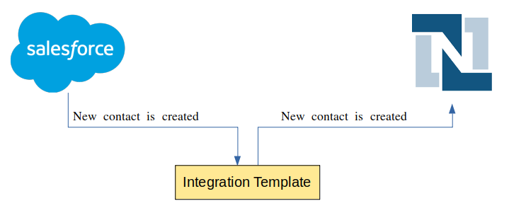

# Template: Salesforce new contact to NetSuite contact
When a new contact in Salesforce is created, creates a new NetSuite contact  <br>

This integration template helps to create a new contact in Netsuite for each new contact in salesforce. There is a listener in the template. It listens any new contact creation events in salesforce. If there is a newly created contact in the salesforce then this template fetch the data of that contact record and create a new contact record in the NetSuite.  



## What you need

- [Ballerina Distribution](https://ballerina.io/learn/getting-started/)
- A Text Editor or an IDE ([VSCode](https://marketplace.visualstudio.com/items?itemName=ballerina.ballerina), 
[IntelliJ IDEA](https://plugins.jetbrains.com/plugin/9520-ballerina)).  
- [Salesforce Connector](https://github.com/ballerina-platform/module-ballerinax-sfdc) and [NetSuite Connector](https://github.com/ballerina-platform/module-ballerinax-netsuite) will be downloaded from 
[Ballerina Central](https://central.ballerina.io/) when running the Ballerina file.

## How to set up

Let's first see how to add the Salesforce configurations for the application.
### Setup Salesforce configurations
Create a Salesforce account and create a connected app by visiting [Salesforce](https://www.salesforce.com). 
Obtain the following parameters:

* Salesforce Username
* Salesforce Password with security token
* [Select Objects](https://developer.salesforce.com/docs/atlas.en-us.change_data_capture.meta/change_data_capture/cdc_select_objects.htm) for Change Notifications in the User Interface of Salesforce account.

For more information on obtaining Security token, visit 
[Salesforce help documentation](https://help.salesforce.com/articleView?id=sf.user_security_token.htm&type=5) 
or follow the 
[Setup tutorial](https://medium.com/creme-de-la-crm/salesforce-how-to-abcs-g-bfa592792649).


Now let's see how to add NetSuite configurations
### Setup NetSuite configurations
1. Visit [NetSuite](https://www.netsuite.com) and create an Account.
2. Enable the SuiteTalk Webservice features of the account (Setup->Company->Enable Features).
3. Obtain the SuiteTalk Base URL, which contains the account ID under the company URLs (Setup->Company->Company
 Information).
    E.g., https://<ACCOUNT_ID>.suitetalk.api.netsuite.com
4. Create an integration application (Setup->Integration->New), enable TBA code grant and scope, and obtain the 
following credentials: 
    * Client ID
    * Client Secret
5. Obtain the below credentials by following the token based authorization in the [NetSuite documentation](https://system.na0.netsuite.com/app/help/helpcenter.nl?fid=book_1559132836.html&vid=_BLm3ruuApc_9HXr&chrole=17&ck=9Ie2K7uuApI_9PHO&cktime=175797&promocode=&promocodeaction=overwrite&sj=7bfNB5rzdVQdIKGhDJFE6knJf%3B1590725099%3B165665000). 
    * Access Token
    * Access Token Secret


Obtain the following parameters:

* Client Id
* Client Secret
* Access Token
* Access Token Secret

## Configuring the Integration Template

Once you obtained all configurations, Replace "" in the `Config.toml` file with your data.

#### Config.conf
``` 
[<ORG_Name>.sfdc_new_contact_to_netsuite_contact]
sfdcUsername = "<Salesforce Username>"
sfdcPassword = "<Salesforce Password>"
nsAccountId = "<account Id>"
nsConsumerId = "<consumer Id>"
nsConsumerSecret = <consmer Secret>
nsToken = "<access token>"
nsTokenSecret = "<tokenSecret>"
nsBaseURL = "<baseURL>"
nsSubsidiaryId = "<Subsidiary ID of the contact>"
```
## Running the Template

1. First you need to build the integration template and create the executable binary. Run the following command from the root directory of the integration template. 
`$ bal build`. 

2. Then you can run the integration binary with the following command. 
`$ bal run target/bin/sfdc_new_contact_to_netsuite_contact.jar`. 


Once you run, successful listener startup will print following in the console.
```
>>>>
[2021-01-27 13:02:32.879] Success:[/meta/handshake]
{ext={replay=true, payload.format=true}, minimumVersion=1.0, clientId=2qw18mvbp4r5o16025e384re8hk7, supportedConnectionTypes=[Ljava.lang.Object;@7dd62bd0, channel=/meta/handshake, id=1, version=1.0, successful=true}
<<<<
>>>>
[2021-01-27 13:02:33.040] Success:[/meta/connect]
{clientId=2qw18mvbp4r5o16025e384re8hk7, advice={reconnect=retry, interval=0, timeout=110000}, channel=/meta/connect, id=2, successful=true}
<<<<
```

3. Now you can create a new Salesforce Contact and observe that integration template runtime has received the event notification for the created Salesforce Contact.

4. Also you can check the Netsuite Contact list , there will be a new contact with information from the Salesforce new contact record.
